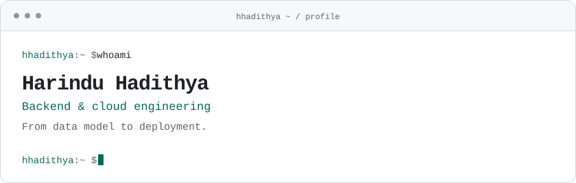

<picture>
  <source media="(prefers-color-scheme: dark)" srcset="./dark_mode.svg">
  
</picture>

I’m **Harindu Hadithya Nanayakkara**, a final-year IT undergraduate at the **University of Moratuwa**, Sri Lanka.

My experience spans full-stack development, with most of my attention going to **backend systems and cloud infrastructure**. I enjoy connecting the pieces—from data models and APIs to the way a service is deployed and maintained.

### How I approach engineering

I tend to keep asking *why* until I can explain how something works. I like breaking unfamiliar problems into smaller parts, questioning assumptions, and understanding the decisions behind the code I ship.

I care about correctness, readable code, and how a change fits into the wider system. I use AI in my development workflow, but understanding and reviewing the result is part of the work I take responsibility for.

### What I work with

**Backend** · C# / .NET, Java / Spring Boot, TypeScript / Node.js  
**Data** · PostgreSQL, SQL Server, Entity Framework Core  
**Cloud & delivery** · AWS, Azure, Docker, Terraform, GitHub Actions  
**Frontend** · React, Next.js

### What keeps me curious

Computer architecture, the reasoning behind system design, and applied AI. My independent study explores Sinhala–English code-switching; outside engineering, I also enjoy design and explaining technical ideas to others.

I’m still shaping my direction, with backend and cloud engineering as my foundation and an interest in how AI can become part of useful software.

---

[Email](mailto:hhadithya34@gmail.com) · [LinkedIn](https://www.linkedin.com/in/harindu-hadithya-nanayakkara-b63aaa240/) · [Writing](https://medium.com/@hhadithya)
